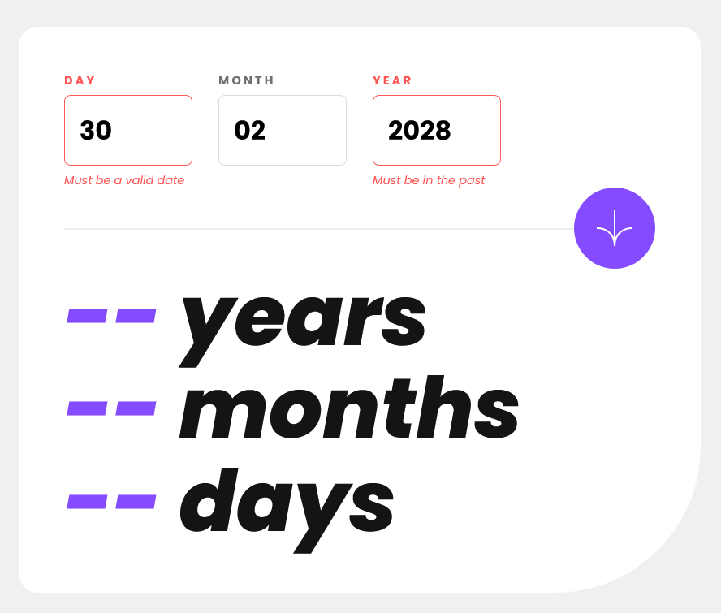

# Frontend Mentor - Age calculator app solution

This is a solution to the [Age calculator app challenge on Frontend Mentor](https://www.frontendmentor.io/challenges/age-calculator-app-dF9DFFpj-Q). Frontend Mentor challenges help you improve your coding skills by building realistic projects.

## Table of contents

- [Frontend Mentor - Age calculator app solution](#frontend-mentor---age-calculator-app-solution)
  - [Table of contents](#table-of-contents)
  - [Overview](#overview)
    - [The challenge](#the-challenge)
    - [Screenshot](#screenshot)
    - [Links](#links)
  - [My process](#my-process)
    - [Built with](#built-with)
    - [What I learned](#what-i-learned)
    - [Continued development](#continued-development)
  - [Author](#author)

## Overview

### The challenge

Users should be able to:

- View an age in years, months, and days after submitting a valid date through the form
- Receive validation errors if:
  - Any field is empty when the form is submitted
  - The day number is not between 1-31
  - The month number is not between 1-12
  - The year is in the future
  - The date is invalid e.g. 31/04/1991 (there are 30 days in April)
- View the optimal layout for the interface depending on their device's screen size
- See hover and focus states for all interactive elements on the page
- **Bonus**: See the age numbers animate to their final number when the form is submitted

### Screenshot

### Links

- Solution URL: [GitHub repo](https://github.com/pbryan9/fm_age_calculator)
- Live Site URL: [Netlify deploy](https://main--golden-cocada-6ba66f.netlify.app/)

## My process

### Built with

- Semantic HTML5 markup
- CSS custom properties
- Flexbox
- Mobile-first workflow
- Vitest (basically Jest)
- [React](https://reactjs.org/) - JS library
- [Styled Components](https://styled-components.com/) - For styles

### What I learned

In addition to the continued practice with styled-components (which I continue to dig), I used this project to hammer on TDD, at least for the age calculation logic. I've written the odd test here and there before, but this was the first time I've used something approaching a "proper" TDD approach to design a bit of logic. It sometimes felt a little tedious here and there, but I did very much enjoy the shift in approach. I know that I came up with different code than I would have if I had kept to my normal path of just writing out the logic and checking it at runtime, but I think the change is a good one -- the logic was nicely testable down to a pretty granular level, and it gave me confidence to call that piece "done" so that I could turn my focus to rendering (which I stopped short of automated testing on this one).

### Continued development

I got a little lazy and stopped short of refining the logic to deal with leap years. Also, I didn't notice the bonus prompt (animate the numbers) until just now. Next time!

## Author

- Website - [Patrick Bryan](https://pattyb.dev)
- Frontend Mentor - [@pbryan9](https://www.frontendmentor.io/profile/pbryan9)
